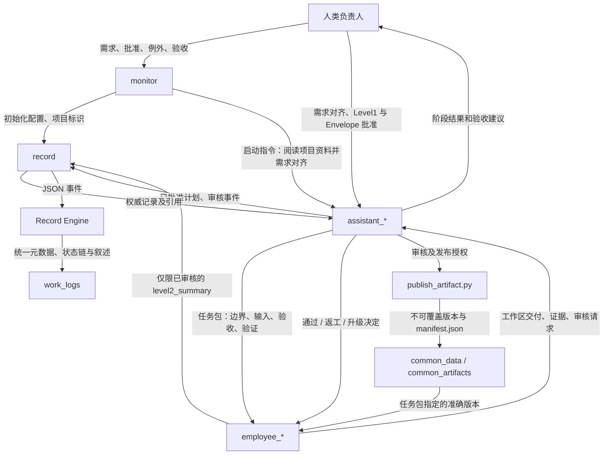
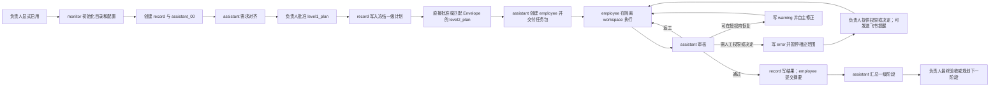

# 多智能体项目协作机制

> **人类负责决策，Agent 分级协作，所有关键过程可追溯。**
>
> 一个仅可显式调用的 Codex Skill，用于由人类负责人主导、全程可审计的多智能体项目。

| 调用方式 | 核心角色 | 默认工作语言 | 适用范围 |
| --- | --- | --- | --- |
| 显式调用 | monitor / assistant / employee / record | 中文 `zh-CN` | 任意需要多 Agent 分工与可追溯记录的项目 |

**快速导航：** [启用方式](#使用方式) · [项目启动](#项目启动) · [目录结构](#启用后的目录结构) · [角色权责](#角色权责) · [数据流](#数据流事实与工件如何流动) · [流程流](#流程流从讨论到验收) · [情景演绎](#情景演绎三个并行任务返工与权限阻塞)

---

## V2：受控共享与边界内自治

V2 在 V1 的“人类最终决策、隔离 workspace、两级计划、append-only 记录”之上，增加以下能力：

| V2 能力 | 解决的问题 | 默认边界 |
| --- | --- | --- |
| `common_data/` / `common_artifacts/` | 多 Agent 复用已审核中间产物 | 仅经 audit + 版本化 publish；employee 不可直接写 |
| `assistant_workspace/` 与 Stage DAG | 多 assistant 分模块并行 | coordinator 管跨模块与 `project_demo/`；模块 assistant 只写自身空间 |
| Authority Envelope | 避免负责人逐项审批低风险返工与派发 | Level 1 由负责人预先明确边界；R3 永远人工批准 |
| Record Engine | 将字段、状态、引用、依赖校验变为确定性程序 | record 仍负责可读叙述，不单独裁定合法性 |
| Feishu escalation | 真正需人工决定时主动提醒 | owner intervention 事件及已启用的启动连通性检查；飞书不是审批入口 |

> [!IMPORTANT]
> V2 位于独立 `v2` 分支，V1 `main` 不被改写。已有 V1 项目可以安全运行初始化器补齐目录；历史工作记录和任务身份保持可读且不可重写。

共享工件的唯一正式路径是：`employee workspace → assistant audit → publish_artifact.py → immutable common_data/common_artifacts version + manifest`。每一个已发布版本均包含生产任务、审核引用、来源和 SHA-256 内容散列；下游任务必须引用具体版本。

发布范围必须与 accepted audit 的 `employee_delivery_reference` 完整一致。引擎在 submitted 时保存内容散列；audited 匹配最近提交的轮次和路径，接受时还匹配 hash，发布器再次比对。从目录截取子路径或改动内容都要重新提交/审核。发布需父阶段对应 publish_permissions 或计划内真实 owner_publication_approval_evidence，仅批准派发并不足够。发布后的 payload、manifest 与审核快照可离线核对，无须永久保留原工作区。

---

它将决策、规划、执行、治理和可追溯记录分为五类角色：

- 人类项目负责人：审批、决策、例外处理与最终验收；
- `monitor`：默认的项目首个对话；检查目录结构、创建缺失的标准路径，并维护负责人确认的规则；
- `assistant`：规划、派发已批准工作，并审核交付；
- `employee`：在隔离工作区完成一个边界明确的任务，结束后请求 assistant 审核；
- `record`：仅负责校验和写入可审计的工作记录。

Skill 提供标准项目目录（含 `raw_data/`）、`AGENTS.md` 与规则模板、两级工作记录约定、边界明确的任务包模板，以及可选的初始化和只读校验脚本。`monitor` 会直接创建缺失的标准路径，随后向负责人索取经确认的全局任务标识（例如 `QSV5` 或 `TLTK`）、可选的角色默认配置、工作语言和项目特色规则。它可以提出任务标识建议，但绝不自行设定。初始化后，它会创建 `record|工作记录` 和 `assistant_00`，分别用于受控记录与项目初始熟悉。employee 仅可将其经 assistant 审核通过的 `level2_summary` 直接提交给 record；`record` 始终是 `work_logs/` 的唯一写入者。默认智能水平为：assistant 使用 GPT-5.6 Terra/high，employee 使用 GPT-5.6 Luna/high，record 使用 GPT-5.6 Luna/medium；只有负责人可通过 `monitor` 修改这些默认值。

每次 assistant 准备制定计划、形成行动决策或派发 employee 前，Skill 会自动应用四象限需求对齐：已确认的共同信息、负责人已知但 agent 未知的关键缺口、agent 可补充的知识/风险/替代方案，以及双方共同未知且应转化为可验证假设的问题。信息充分时不会重复提问，关键对齐问题最多十个。

每个获批准阶段在派发 employee 前先建立冻结的 `level1_plan`，保存授权、范围、验收、委派和升级机制。实质变更使用负责人批准的新计划与新身份，通过 `supersedes_reference` 关联旧计划；变更原因可追加记录，但不能借叙述改动旧 Envelope、依赖或权限。

每个被派发的 employee 必须拥有冻结的、关联 Level 1 的具体 `level2_plan`，随后获得任务包。授权来源有两种：负责人直接批准（`owner-approved`），或匹配负责人已批准的 Authority Envelope（`envelope-authorized`）。边界内的派发、替换、重试、修正、测试返工和任务内重构无需重复请示；超出边界或改变 Level 1 实质目标/交付时才需要负责人。不同任务目标或交付使用新的任务码，旧记录保留。

Skill 提供专用模板，用于追加式的 employee 审核尝试记录、最终结果、摘要、警告/错误恢复与暂停记录、assistant 阶段摘要，以及由 record 生成的阶段结果。

初始化时，`monitor` 还会询问可选的项目工作语言，默认中文（`zh-CN`）。中文项目使用随 Skill 提供的 `_CN` 记录模板，所有叙述性文本均为中文；用于校验的稳定元数据键名保持统一。

## 使用方式

将 Skill 安装到 Codex skills 目录后，显式调用：

```text
$multi-agent-project-collaboration-mechanism
```

或直接告诉 Codex：项目要启用该协作机制。Skill 不会隐式自动启用。

对于项目长期事实、需求与架构上下文，建议与 `my-context-manage` 等项目上下文系统配合使用。

> [!TIP]
> 本 Skill 管理多 Agent 的执行、审核与记录流；`my-context-manage` 管理长期项目事实与会话收口。二者均不替代 Git 的版本历史或文件系统的硬权限控制。

---

## 项目启动

负责人第一次在项目中启用 Skill 后，该对话即作为 `monitor`。monitor 先检查项目根目录并直接创建缺失的标准机制路径，绝不覆盖已有文件；然后一次性向负责人请求以下配置：

1. 项目标识（**必填**）：例如 `QSV5`、`TLTK`。monitor 可以给出建议，但只能由负责人确认，不能自行使用任何默认标识。
2. record 的默认模型与推理强度（可选）：省略时为 GPT-5.6 Luna / medium。
3. assistant 的默认模型与推理强度（可选）：省略时为 GPT-5.6 Terra / high。
4. employee 的默认模型与推理强度（可选）：省略时为 GPT-5.6 Luna / high。
5. 项目特色规则（可选）：省略即当前没有额外规则。
6. 工作语言（可选）：省略时为中文 `zh-CN`。
7. 飞书通知（可选）：新项目默认开启；重复初始化保留已有选择，负责人可明确关闭或修改。

项目标识被负责人明确确认前，不创建启动 Agent。初始化配置写入 `rules/00-core-governance.md`。中文项目选择 `_CN` 记录模板，叙述、证据解释、限制与下一步使用中文；机器字段由统一 schema 定义。记录模板提供 JSON 事件，Record Engine 校验后生成 Markdown 的机器元数据。

飞书开启时，monitor 调用通知适配器发送 `XXXX_项目已启动飞书监控` 连通性检查。真实 URL 与 SECRET 只从 `FEISHU_WEBHOOK_URL` / `FEISHU_WEBHOOK_SECRET` 环境变量读取；项目 JSON 示例只含 `{"enabled": true}`。HTTP 200 还必须同时获得飞书业务成功响应才视为连通。缺配置或失败会在负责人对话中提示配置或关闭，项目初始化仍可继续。通知开关会实际持久化，不只是打印提示。

修复配置后可运行 `python root/notifications/feishu.py . --startup --material-update` 重新测试；普通重复调用仍会去重。`--resolve EVENT_ID` 仅表示该通知已处理，正式授权与验收仍通过项目对话记录。

配置完成后，monitor 创建且只创建两个启动对话：

- `record|工作记录`：唯一能写入 `work_logs/` 的角色；
- `assistant_00|<初始范围>`：阅读项目已有资料后向负责人提出一至十个关键需求对齐问题。

> [!IMPORTANT]
> 在项目标识由负责人明确确认前，monitor 不得创建启动 Agent，也不得以 `A` 或其他占位标识替代。

---

## 启用后的目录结构

```text
<项目根目录>/
├── AGENTS.md                         # 全部 Agent 的路由、角色和文件权限
├── rules/                            # 负责人确认后的治理规则
│   ├── 00-core-governance.md          # 项目标识、模型默认值、语言、特色规则
│   ├── 01-role-and-filesystem.md      # 角色职责和路径边界
│   └── 02-work-log-governance.md      # 记录类型、状态机、提交路径
├── root/                             # 机制工具；不是业务源码或交付目录
│   ├── README.md                     # 本目录的中文说明
│   ├── governance_schema.py          # 引擎与校验器共用规范
│   ├── record_engine.py              # 由真实历史恢复状态并写入记录
│   ├── publish_artifact.py           # 已审核工件的不可覆盖版本发布
│   ├── validate_project_governance.py # 只读结构、状态链、DAG 与 provenance 校验
│   ├── notifications/
│   │   ├── feishu.py                 # 提醒适配器；凭证只来自环境变量
│   │   └── feishu_config_example.json # 仅 enabled 布尔开关
│   └── templates/                    # JSON 事件、接口、manifest 与 *_CN.md
├── plan/                             # 计划草案；不等同于正式批准记录
│   └── interfaces/                   # 有版本的跨模块接口契约
├── draft/                            # 临时材料；不等同于项目事实
├── ai_workspace/                     # employee 的隔离工作区
│   └── <任务名>/
├── work_logs/                        # 权威事件记录；只有 record 可写
├── assistant_workspace/              # 各模块 assistant 的隔离集成区
│   └── <assistant-id>/
├── common_data/                      # 已审核共享数据
│   └── <artifact-id>/v0001/          # manifest.json + 工件内容
├── common_artifacts/                 # 已审核代码/文档/模型等共享工件
├── raw_data/                         # 原始输入数据
├── project_demo/                     # 演示性输出
└── project_final/                    # 获负责人授权后的正式交付物
```

employee 只写自己的 `ai_workspace/<任务名>/`。审核后的共享发布和模块集成可使用已批准 Envelope；模块 assistant 只集成自己的空间，当前阶段的 coordinating assistant 独占获授权的 `project_demo/` 集成。`project_final/` 和 R3 操作始终需要负责人明确批准。`work_logs/` 保存关键事件、证据和状态。初始化器只向 `.gitignore` 幂等追加固定的通知本地状态保护项，不删改原有规则。

> [!NOTE]
> `plan/` 与 `draft/` 可以承载探索和讨论；只有 record 写入的 `work_logs/` 才承载工作流中的权威事件记录。

---

## 角色权责

| 角色 | 可做什么 | 明确禁止 |
| --- | --- | --- |
| 人类负责人 | 确认规则、范围、计划、派发、例外、整合及最终验收 | 无工作流限制 |
| `monitor` | 初始化目录，记录负责人确认的治理配置，创建 record 与 `assistant_00`，传达负责人批准的任务标识变更 | 规划技术工作、改业务代码、派发 employee、审核、写 `work_logs/` |
| `assistant_NN` | 对齐需求，提出计划，按直接批准或 Envelope 派发/修正，审核并执行已授权的共享发布和集成 | 超越目标、交付、任务类型、并发、读写或风险边界；未经明确批准执行 R3 |
| `employee_NN` | 完成一个受限任务，提供工件和验证证据，向创建自己的 assistant 请求审核 | 写规则、`AGENTS.md`、`work_logs/`、其他 workspace；自行验收或整合 |
| `record` | 校验记录字段、任务码、引用和审核状态，写入 `work_logs/` | 推断事实、改技术结论、规划、派发、写代码、联系 monitor |

负责人可在对话中用 `a00` 指代 `assistant_00`、用 `e00` 指代 `employee_00`。所有 Agent 必须识别这种简称，但在 Agent 间沟通、回复负责人、任务包、文件名和记录中只能使用完整正式名称。

---

## 任务码、计划与工作包

employee 任务码为：

```text
<项目标识>_<一级任务>-<assistant>-<employee>-<employee任务序号>
QSV5_02-04-014-0008
```

四个数字段依次为一级任务（2 位）、assistant（2 位）、employee（3 位）、employee 任务（4 位），均从零开始。一级聚合记录允许将下游未知段记为 `#`，如 `QSV5_02-##-###-####`；二级记录必须使用完整数字任务码。

| 层级 | 权威记录 | 创建时机 | 冻结内容 |
| --- | --- | --- | --- |
| Level 1 | `level1_plan_<aggregate-code>.md` | 负责人明确批准阶段计划后，任何 employee 创建/派发前 | 阶段目标、范围与非目标、验收、计划委派、风险、验证和升级机制 |
| Level 2 | `level2_plan_<task-code>.md` | 直接批准或匹配已批准 Envelope 后，employee 创建前 | 授权来源、输入、读写范围、工作区、交付物、审核和中断处理 |

同一任务的边界内修正由 assistant 自主处理并经 record 追加事件；改变 Level 1 目标、实质交付或 Envelope 限制需要负责人批准。不同 employee 任务目标/交付使用新序号、新任务码和新计划，授权可继续来自匹配的 Envelope。冻结基线从不覆盖。

冻结后的读写范围、依赖和授权如需改变，同样创建新计划/新任务身份，以 `supersedes_reference` 关联旧计划。该引用只用于溯源，不自动取消旧任务；旧状态仍需通过合法转换结束。本轮不提供原位修改计划的通用机制。

负责人通过 monitor 修改项目标识时，保留原标识、当前标识和已确认 aliases。旧任务码、文件名及内部引用永久不变；新任务可采用新标识，校验器同时接受合法历史标识。

`TASK_PACKAGE.md` 是从已批准的 level2 计划派生出的操作指令，必须包含任务目标、必读上下文、允许范围、非目标、不可更改的确认决策、验收与验证命令、交付格式、升级条件，以及“完成后必须请求 assistant 审核”的要求。

---

## 数据流：事实与工件如何流动

数据流传递事实、工件、证据与审计结论；它不能绕过角色权限。



对应规则：

- 负责人可直接和 monitor、assistant 对话；monitor 不接收其他 Agent 的指令。
- employee 的日常上级只有其创建 assistant；employee 的每次完成都要带证据请求审核。
- 除 `level2_summary` 外，employee 不能直接向 record 提交记录；计划、中间结果、最终结果、warning/error 均由 assistant 提交。
- employee 直接提交 `level2_summary` 的前提是 assistant 已接受其任务范围内交付，且摘要引用该审核和 `level2_results`。
- record 只在核对任务码、必填字段、引用和审核状态后写入权威副本。

> [!CAUTION]
> 数据可以被读取，不意味着拥有改写或批准权限。任何数据流都不能绕过计划冻结、assistant 审核或人类负责人审批。

---

## 流程流：从讨论到验收

流程流描述任务如何由“讨论”变成“经批准的行动”，再变成“可验收的结果”。



assistant 形成计划、行动决策或准备派发前，自动执行四象限对齐：

1. 共同已知：确认目标、背景、交付标准和边界；充分时不重复询问。
2. 负责人已知、Agent 未知：仅当信息缺失会实质改变结果时提问，最多十个；否则明确合理假设并先做探索。
3. 负责人未知、Agent 已知：主动补充方法、风险、替代方案和取舍；必要时指出前提错误。
4. 共同未知：转化为可验证假设，必要时提出最小实验、单一变量、成败信号与所需数据。

employee 被派发后，assistant 默认不频繁打断工作；预期超过十分钟的任务须给出估时，assistant 至多每十分钟检查一次，且默认最多主动管理五个 employee。

---

## 记录生命周期

一个二级任务的正常记录链：

```text
level1_plan
  → level2_plan
  → level2_results_mid（可重复追加的交付/审核尝试）
  → assistant 接受审核
  → level2_results
  → level2_summary
  → level1_summary / level1_results
```

`level2_results_mid` 保留执行与审核事件，包括派发、运行、提交、审核、拒绝和返工。正常状态为 `planned → dispatched → running → submitted → audited → accepted`。Engine 从真实历史恢复前态，拒绝 `running → accepted`，也拒绝调用者伪造前态。最终结果需关联真实计划、提交和 accepted assistant audit；之后 employee 才可提交 `level2_summary`。

元数据分三类：`record_status: final` 表示事件已落盘，`plan_status: frozen` 表示计划基线冻结，`execution_status` 表示任务或阶段状态。Level 1 使用 planned/active/paused/failed/accepted/closed/cancelled；Level 2 另有 dispatched/running/submitted/audited/integrated，避免用一个 `status` 混合不同含义。

异常记录同样只追加：

- `level2_warning`：某一个 employee 任务可恢复的中断，说明恢复负责人、计划与条件；
- `level2_error`：某任务需要负责人提供权限或作出决定，该 employee 暂停；
- `level1_warning`：一级阶段的可恢复风险；
- `level1_error`：一级阶段严重错误，阶段内全部 employee 暂停至负责人决定。

warning 升级为 error 时，warning 不删除，另建关联的 error。所有修复、恢复或结论都作为新的记录或追加条目存在。

> [!IMPORTANT]
> “追加”是本机制的审计底线：不能用覆盖、重命名或删除来掩盖一次失败、阻塞或旧决策。

---

## 情景演绎：三个并行任务、返工与权限阻塞

以下以项目标识 `XXXX` 和第一个一级任务为例，完整演绎协作及记录如何变化。

<details open>
<summary><strong>阶段 A｜启动、需求对齐与计划冻结</strong></summary>

1. 负责人在项目根目录启用 Skill；首个对话成为 monitor。monitor 补齐结构，负责人确认 `XXXX` 及可选配置。
2. monitor 创建 `record|工作记录` 与 `assistant_00`。assistant 阅读已有参考文件、数据、规则、计划和草稿，并经若干轮对话完成需求对齐。
3. `assistant_00` 提出首个 Level 1 计划及 Authority Envelope，明确目标、交付、任务类型、最多三个并行 employee、读写与风险边界。负责人一次批准后，record 通过引擎写入 `level1_plan_XXXX_00-##-###-####.md`。此前不会有 employee 或二级计划。
4. assistant 验证三个执行单元都在 Envelope 内，按 `envelope-authorized` 建立三个计划，无须负责人逐项批准；record 写入：

```text
level2_plan_XXXX_00-00-000-0000.md
level2_plan_XXXX_00-00-001-0000.md
level2_plan_XXXX_00-00-002-0000.md
```

5. 仅在各自 level2 计划落盘后，assistant 才创建三个 employee，并向其发送相应任务包。三个 employee 只在各自 `ai_workspace/` 下写入。

</details>

<details>
<summary><strong>阶段 B｜employee_00：两次返工后通过审核</strong></summary>

1. `employee_00` 经派发和运行后首次交付，请求 `assistant_00` 审核。record 已记录 dispatched/running/submitted 状态；审核不通过时在 `level2_results_mid_XXXX_00-00-000-0000.md` 追加 rejected audit，并按 Envelope 自主要求限定范围返工。
2. 第二次交付仍不通过，record 在同一中间结果记录追加第二次审核尝试；首次证据与失败原因完整保留。
3. 第三次交付通过，状态沿 running → submitted → audited 推进。assistant 提交接受证据，record 经引擎验证后创建 accepted 的 `level2_results_XXXX_00-00-000-0000.md`。employee 随后将引用审核和最终结果的 `level2_summary_XXXX_00-00-000-0000.md` 直接提交 record。两次返工使用原 Envelope，均不再次请求负责人。

</details>

<details>
<summary><strong>阶段 C｜employee_01：修正命令后恢复</strong></summary>

1. `employee_01` 执行遇到中断。assistant 判断仅需修正任务包内的执行命令，不需负责人作新决定，于是向 record 提交 `level2_warning_XXXX_00-00-001-0000.md`，记录中断、恢复计划与恢复条件。
2. assistant 修正指令边界后，employee 恢复执行并正常通过审核。record 继续写入该任务的中间审核、最终结果与摘要。warning 保留并链接最终结果，形成可追溯恢复链。

</details>

<details>
<summary><strong>阶段 D｜employee_02：人工权限介入后恢复</strong></summary>

1. `employee_02` 也遇到中断；assistant 判断必须由负责人手动提供某权限，不能自行越权处理，于是提交 `level2_error_XXXX_00-00-002-0000.md`，注明直接证据、暂停范围和所需负责人动作。
2. 此时暂停的仅是 `employee_02`；其他 employee 继续。事件包含 `owner_intervention_required: true`；通知启用且凭证可用时，适配器发送一次飞书提醒。发送失败会在当前负责人对话回退说明；飞书回复本身不构成批准。
3. 负责人提供权限或明确授权。assistant 将授权与恢复条件提交 record，employee 继续执行并最终通过审核；record 写入该任务的中间结果、最终结果和摘要。error 不删除，完整保留“阻塞—人工处理—恢复—完成”链。

</details>

<details>
<summary><strong>阶段 E｜一级汇总与负责人验收</strong></summary>

三个二级任务完成后，assistant 在 Envelope 内发布经审核的准确共享版本，必要时由 coordinating assistant 完成获授权的 demo 集成，再提交 `level1_summary_XXXX_00-00-###-####.md`。assistant 请求负责人验收；负责人明确接受后，record 才写入 `level1_results_XXXX_00-##-###-####.md`，一级阶段进入 accepted 并可关闭/规划下一阶段。写入 `project_final/` 仍需负责人明确批准。

若发生的是 Level 1 error 而非某个 employee 的二级错误，则 record 记录 `level1_error_XXXX_00-00-###-####.md`，并暂停该一级阶段的全部 employee，直到负责人决定恢复、调整或终止。

</details>

---

## 模板与校验边界

`root/templates/` 包含 `LEVEL1_PLAN[_CN].md`、`LEVEL2_PLAN[_CN].md`、`TASK_PACKAGE[_CN].md`、各类记录模板，以及 `INTERFACE_CONTRACT.json`、`ARTIFACT_MANIFEST.json` 和治理事件示例。中文项目优先使用 `_CN`。记录模板的 JSON 字段与引擎/校验器共享 schema；调用者只填写事件，不直接拼接权威 front matter。

`root/validate_project_governance.py` 只读检查目录、身份 aliases、统一字段/状态、真实记录链、任务依赖状态、DAG/接口、manifest 哈希及审核来源。V1 缺 V2 特性只 warning，V2 严格校验；旧 JSON 内容的 `manifest.yaml` 可兼容读取，新发布只生成 `manifest.json`。技术正确性仍由 assistant 依据真实证据审核。

## 回归验证

在 Skill 仓库根目录运行（Python 3.10+，治理脚本与测试仅使用标准库）：

```bash
python -B -m unittest discover -s tests -v
```

测试会创建临时项目并模拟飞书网络，不读取真实凭据或向真实机器人发消息；包含全部 11 类记录的中英文模板回读、完整发布与消费链，以及非法状态、路径、权限和内容变更的拒绝场景。真实符号链接用例在系统不允许创建链接时会明确跳过，另有不依赖该权限的防护测试。

本轮基线、逐阶段修复、兼容边界与实际测试结果见 [V2 Hardening 说明](docs/V2_HARDENING_NOTES.md)。旧项目重新初始化只补缺失文件，不会悄悄替换已有工具；启用加固引擎前由 monitor 安排明确的迁移审查。

## 许可证

[MIT](LICENSE)
